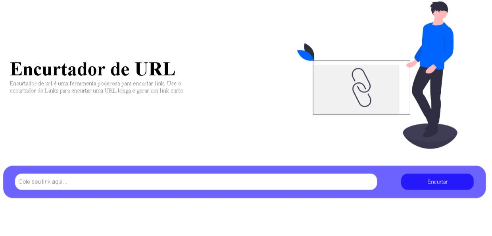

# EncurtadorDeURL
Site feito usando a API de um site de encurtamento de URLs, treinando requisição a APIs externas

https://levivromao.github.io/EncurtadorDeURL/

##

##

Só colocar a URL ali no campo e apertar o botão, que seu link curto será gerado.
